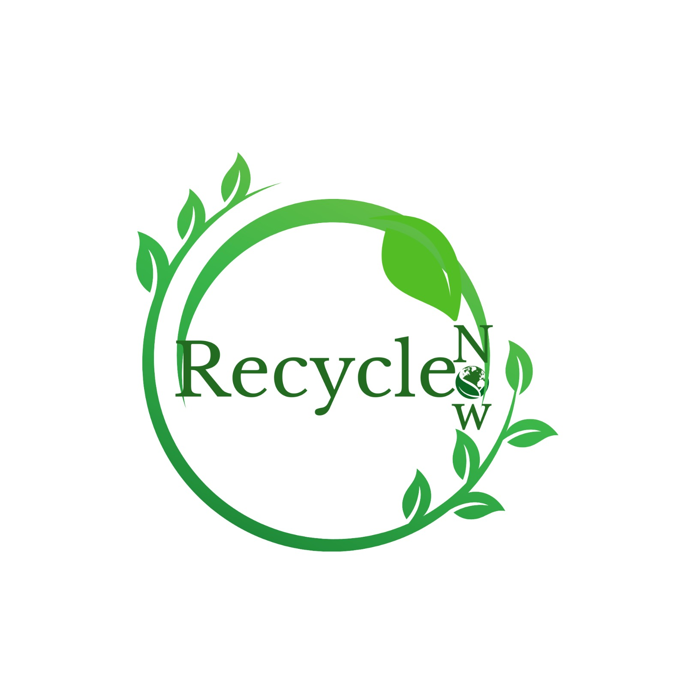
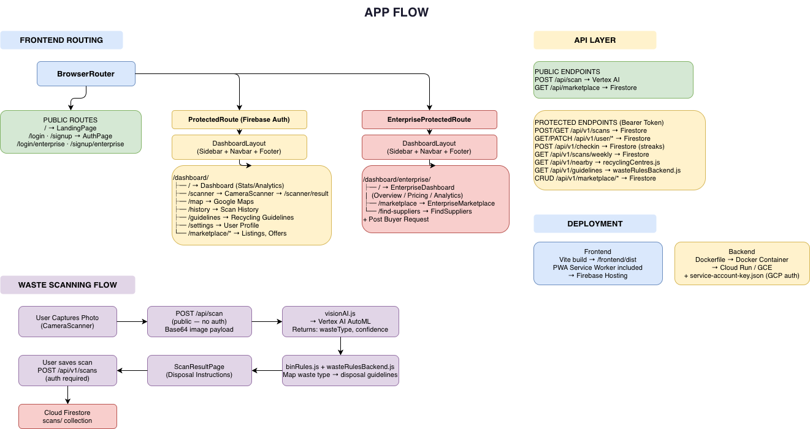
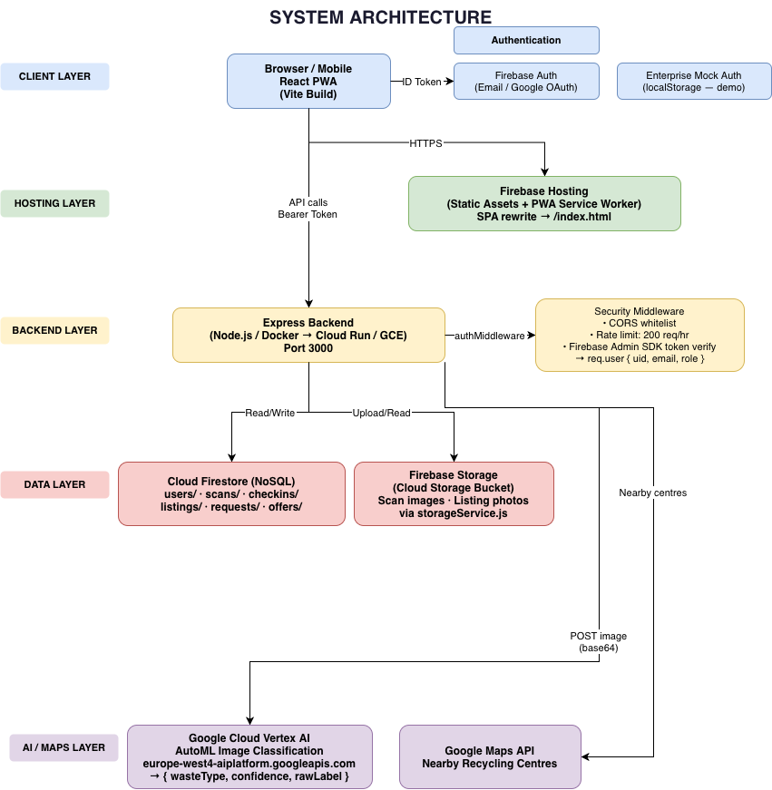

<p align="center">
  
</p>

# RecycleNow

**AI-Powered Smart Waste Management & Recycling Marketplace**

> Scan. Sort. Sustain. — Making responsible waste disposal effortless through computer vision and community-driven recycling.

Built for **KITA HACK** organized by **Google Developer Group Malaysia**.

RecycleNow is a full-stack Progressive Web App that helps users classify waste instantly using computer vision, find nearby recycling centres, trade recyclable materials on a marketplace, and build sustainable habits through gamification — all aligned with **UN SDG 4: Quality Education & SDG 12: Responsible Consumption and Production**.

---

## Table of Contents

- [App Flow](#app-flow)
- [System Architecture](#system-architecture)
- [Features](#features)
- [Tech Stack](#tech-stack)
- [Technical Architecture](#technical-architecture)
- [Implementation Details](#implementation-details)
- [Project Structure](#project-structure)
- [Getting Started](#getting-started)
- [Environment Variables](#environment-variables)
- [API Reference](#api-reference)
- [Firestore Data Schema](#firestore-data-schema)
- [Challenges Faced](#challenges-faced)
- [Future Roadmap](#future-roadmap)

---

## App Flow



## System Architecture



---

## Features

| Feature | Status | Description |
|---------|--------|-------------|
| Computer Vision Scanner | ✅ Live | Capture waste images → Vertex AI AutoML classifies into plastic, glass, metal, paper, clothes, general waste |
| Disposal Guidelines | ✅ Live | Category-specific disposal rules with interactive checklist (clean, separate, compact) |
| Recycling Centre Map | ✅ Live | Google Maps integration — locate nearby recycling centres, donation points, e-waste collection |
| Scan History | ✅ Live | Full history with image grid, expandable details, disposal status tracking (pending → recycled/donated/disposed) |
| Gamification System | ✅ Live | Points, streaks, daily check-in bonuses, milestone rewards — drives consistent eco-actions |
| Waste Marketplace | ✅ Live | List recyclable materials for sale, browse listings, make offers, negotiate with built-in messaging |
| Enterprise Portal | ✅ Live | Separate mock-auth dashboard for institutional buyers — bulk purchasing, supplier discovery, pricing tiers |
| PWA Support | ✅ Live | Installable on mobile devices, offline-capable with Workbox service worker caching |
| User Authentication | ✅ Live | Firebase Auth with email/password and Google OAuth sign-in |
| Guidelines Education | ✅ Live | Structured waste type rules with country-specific and universal recycling guidance |
| Dashboard Analytics | ✅ Live | Weekly scan charts, impact metrics (CO₂ saved, kg recycled), streak tracking via Recharts |
| Dark Mode | ✅ Live | System-aware dark/light theme toggle with glassmorphism UI design |

---

## Tech Stack

| Layer | Technology |
|-------|------------|
| Frontend | React 19, Vite 7, JSX, React Router 7 |
| Styling | Tailwind CSS 4, glassmorphism design system, Framer Motion animations |
| Maps | Google Maps API (`@react-google-maps/api`), Places Autocomplete |
| Charts | Recharts |
| Icons | Google Material Symbols (font-based) + Lucide React |
| Backend | Node.js, Express 4, Multer (file uploads), Express Rate Limit |
| AI/ML | Google Cloud Vertex AI — AutoML Image Classification endpoint |
| Database | Cloud Firestore (NoSQL) — users, scans, checkins, listings, requests, offers |
| Storage | Firebase Storage (Cloud Storage bucket) — scan images, listing photos |
| Auth | Firebase Authentication (Email/Password + Google OAuth), Enterprise mock auth (localStorage) |
| Hosting | Firebase Hosting (frontend SPA), Docker → Cloud Run / GCE (backend) |
| PWA | VitePWA plugin with Workbox caching strategy |
| Forms | React Hook Form + Zod schema validation |

---

## Technical Architecture

### Client Layer

The frontend is a React 19 Progressive Web App built with Vite 7 and optimized with `babel-plugin-react-compiler`. It uses Tailwind CSS 4 with a custom glassmorphism design system (`backdrop-blur-xl`, `bg-white/60`, `border-white/40`) and Framer Motion for page transitions and micro-interactions.

**Key architectural decisions:**
- **Mobile-first responsive design** using Tailwind breakpoint prefixes (`sm:`, `md:`, `lg:`)
- **Context-based auth** via `AuthContext` wrapping the entire app with Firebase user state
- **Protected routing** with `ProtectedRoute` (Firebase Auth) and `EnterpriseProtectedRoute` (localStorage mock auth) as separate guard components
- **PWA with Workbox** — `registerType: 'autoUpdate'` with runtime caching for API responses and static assets

### Hosting Layer

Firebase Hosting serves the static SPA build (`frontend/dist`) with:
- SPA rewrites (`**` → `/index.html`)
- No-cache headers for service worker files
- HTTPS enforcement

### Backend Layer

Express.js server running on port 3000 with:
- **CORS whitelist** — production domains (`kitahack-487005.web.app`, `kitahack-487005.firebaseapp.com`) and local dev origins
- **Global rate limiting** — 200 requests/hour per IP via `express-rate-limit`
- **Firebase Admin SDK token verification** in `authMiddleware.js` — extracts `uid`, `email`, `role` from Bearer token and attaches to `req.user`
- **15MB request body limit** to accommodate base64-encoded images for waste scanning

### AI / ML Layer

Waste classification uses a **Vertex AI AutoML Image Classification** model deployed on endpoint `europe-west4-aiplatform.googleapis.com`:
1. User captures a photo via device camera (`CameraScanner.jsx`)
2. Image is base64-encoded and sent to `POST /api/scan`
3. Backend `visionAI.js` sends the image to the Vertex AI prediction endpoint
4. AutoML returns classification labels with confidence scores
5. Labels are mapped to app waste types: `plastic`, `glass`, `metal`, `paper`, `clothes`, `general_waste`
6. Frontend displays the result with disposal rules from `binRules.js` + `wasteRulesBackend.js`

### Data Layer

- **Cloud Firestore** — NoSQL document database for all structured data (users, scans, checkins, marketplace listings, offers, requests)
- **Firebase Storage** — Cloud Storage bucket for binary assets (scan images, listing photos) via `storageService.js`

---

## Implementation Details

### Waste Scanning Flow

1. **Image Capture** — `CameraScanner.jsx` accesses device camera, captures a single frame
2. **API Request** — Base64 image payload sent to `POST /api/scan` (public, no auth required for demo accessibility)
3. **Vertex AI Classification** — `visionAI.js` calls AutoML endpoint, receives `{ wasteType, confidence, rawLabel }`
4. **Rule Mapping** — `binRules.js` maps waste type → disposal instructions (which bin, preparation steps)
5. **Result Display** — `ScanResultPage.jsx` shows classification, confidence score, disposal checklist
6. **Save to History** — Authenticated users can persist scan to Firestore via `POST /api/v1/scans` with image upload to Firebase Storage

### Marketplace System

The marketplace enables peer-to-peer trading of recyclable materials:

- **Listings** — Users create listings with waste type, quantity, price, photos, and location
- **Buyer Requests** — Enterprises post what materials they need
- **Offers & Negotiation** — Buyers make offers on listings, sellers can accept/reject/counter with built-in messaging thread
- **Photo Upload** — Listing images stored in Firebase Storage via `storageService.js`
- **Dual Access** — Regular users access via `/dashboard/marketplace`, enterprises via `/dashboard/enterprise/marketplace`

### Enterprise Portal

A separate auth flow using localStorage mock credentials (`demo@company.com` / `demo123`) provides:
- Enterprise dashboard with overview stats, pricing tiers, analytics
- Supplier discovery (`FindSuppliers.jsx`)
- Bulk marketplace access with enterprise-specific UI

### Gamification Engine

- **+5 points** per waste scan saved to history
- **Daily check-in** with streak tracking and milestone bonuses
- **Impact metrics** calculated from scan data — kg recycled, CO₂ saved
- **Weekly activity chart** powered by Recharts

### Map & Nearby Centres

- Google Maps with `@react-google-maps/api` for interactive recycling centre discovery
- `recyclingCentres.js` provides hardcoded centre data for Malaysian locations
- `centreAssignment.js` handles proximity-based sorting and assignment
- Quick-filter buttons for recycling centres, donation points, e-waste collection
- Directions rendering with Google Maps Directions API

### Authentication Architecture

Two parallel auth systems coexist without interference:

| System | Mechanism | Guard Component | Use Case |
|--------|-----------|-----------------|----------|
| Firebase Auth | ID token → Admin SDK verification | `ProtectedRoute` | All user-facing features |
| Enterprise Mock | localStorage flags | `EnterpriseProtectedRoute` | Demo enterprise dashboard |

---

## Project Structure

```
KITA_HACK-2026-FEB/
├── firebase.json                    # Firebase Hosting + Firestore + Storage config
├── firestore.rules                  # Firestore security rules
├── storage.rules                    # Firebase Storage security rules
├── Implementation.md                # Marketplace & enterprise integration plan
│
├── docs/
│   ├── app-flow.png                 # Application flow diagram
│   └── system-architecture.png      # System architecture diagram
│
├── backend/
│   ├── Dockerfile                   # Container build for Cloud Run / GCE
│   ├── package.json
│   ├── service-account-key.json     # GCP service account (git-ignored)
│   └── src/
│       ├── server.js                # Express entry point — CORS, rate limit, route mounting
│       ├── config/
│       │   ├── binRules.js          # Waste type → bin colour + disposal instructions
│       │   ├── firebaseAdmin.js     # Firebase Admin SDK initialization
│       │   ├── recyclingCentres.js  # Malaysian recycling centre dataset
│       │   └── wasteRulesBackend.js # Extended waste disposal rules
│       ├── middleware/
│       │   └── authMiddleware.js    # Firebase ID token verification
│       ├── routes/
│       │   ├── authRoutes.js        # Token verification + user creation
│       │   ├── checkinRoutes.js     # Daily check-in + streak tracking
│       │   ├── guidelinesRoutes.js  # Waste disposal guidelines
│       │   ├── marketplaceRoutes.js # Marketplace CRUD (listings, offers, requests)
│       │   ├── nearbyRoutes.js      # Nearby recycling centres
│       │   ├── scanHistoryRoutes.js # Scan history retrieval
│       │   ├── scanRoutes.js        # Waste scanning (Vertex AI)
│       │   ├── scanSaveRoutes.js    # Save scan results to Firestore
│       │   ├── userRoutes.js        # User profile CRUD
│       │   └── weeklyRoutes.js      # Weekly scan aggregation
│       └── services/
│           ├── centreAssignment.js  # Proximity-based centre matching
│           ├── marketplaceService.js# Marketplace Firestore operations
│           ├── storageService.js    # Firebase Storage upload/download
│           └── visionAI.js          # Vertex AI AutoML prediction client
│
└── frontend/
    ├── index.html
    ├── package.json
    ├── vite.config.js               # Vite + React Compiler + Tailwind + PWA
    ├── public/                      # Static assets (PWA icons, demo images)
    └── src/
        ├── App.jsx                  # Router configuration (all routes)
        ├── main.jsx                 # App entry point
        ├── index.css                # Global styles + Tailwind imports
        ├── components/
        │   ├── CameraScanner.jsx    # Device camera capture component
        │   ├── DashboardLayout.jsx  # Sidebar + Navbar + main content wrapper
        │   ├── DayNightToggle.jsx   # Dark mode toggle switch
        │   ├── DisposalCheckbox.jsx # Disposal step checkbox
        │   ├── EnterpriseProtectedRoute.jsx  # Enterprise auth guard
        │   ├── MainLayout.jsx       # Public page layout
        │   ├── MapSearchBar.jsx     # Google Places Autocomplete search
        │   ├── Navbar.jsx           # Top navigation bar
        │   ├── ProtectedRoute.jsx   # Firebase auth guard
        │   ├── Sidebar.jsx          # Navigation sidebar with collapse
        │   ├── auth/
        │   │   ├── EnterpriseLogin.jsx   # Enterprise mock login
        │   │   ├── EnterpriseSignup.jsx  # Enterprise mock signup
        │   │   └── RoleSelector.jsx      # User/Enterprise role toggle
        │   ├── dashboard/
        │   │   ├── EnterpriseDashboard.jsx  # Enterprise overview + pricing + analytics
        │   │   └── FindSuppliers.jsx        # Supplier discovery
        │   └── marketplace/
        │       ├── CreateListingForm.jsx  # New listing creation
        │       ├── EnterpriseMarketplace.jsx  # Enterprise marketplace view
        │       ├── ListingDetail.jsx      # Single listing detail + offer
        │       ├── Marketplace.jsx        # User marketplace browse
        │       ├── MyListings.jsx         # User's own listings
        │       ├── OfferDetail.jsx        # Offer detail + messaging
        │       └── OffersManagement.jsx   # Sent/received offers dashboard
        ├── config/
        │   ├── api.js               # API base URL configuration
        │   ├── constants.js         # App-wide constants
        │   ├── firebase.js          # Firebase Web SDK initialization
        │   └── wasteRules.js        # Frontend waste disposal rules
        ├── contexts/
        │   └── AuthContext.jsx      # Firebase auth state provider
        ├── hooks/
        │   ├── useDarkMode.js       # Dark/light theme hook
        │   └── useIsMobile.js       # Responsive breakpoint hook
        └── pages/
            ├── AuthPage.jsx         # Login/signup forms
            ├── Dashboard.jsx        # User dashboard (stats, chart, check-in)
            ├── GuidelinesPage.jsx   # Waste disposal guidelines
            ├── HistoryPage.jsx      # Scan history with status tracking
            ├── LandingPage.jsx      # Public landing page
            ├── MapPage.jsx          # Google Maps recycling centre finder
            ├── ScannerPage.jsx      # Camera scanner page
            ├── ScanResultPage.jsx   # Scan result + disposal instructions
            └── SettingsPage.jsx     # Profile, password, data export, delete account
```

---

## Getting Started

### Prerequisites

- Node.js 18+ (Node.js 20 recommended)
- npm 9+
- Firebase project with **Authentication**, **Firestore**, and **Storage** enabled
- Google Cloud project with a **Vertex AI AutoML Image Classification** endpoint deployed
- GCP service account JSON key with Vertex AI prediction permissions

### Installation

```bash
# Clone the repository
git clone https://github.com/your-username/recyclenow.git
cd recyclenow

# Install backend dependencies
cd backend && npm install

# Install frontend dependencies
cd ../frontend && npm install
```

### Backend Credentials

Place your GCP service account key at:

```
backend/service-account-key.json
```

### Start Development Servers

```bash
# Terminal 1 — Backend
cd backend
npm run dev

# Terminal 2 — Frontend
cd frontend
npm run dev
```

- Frontend: `http://localhost:5173`
- Backend: `http://localhost:3000`
- Health check: `http://localhost:3000/api/health`

### Build for Production

```bash
cd frontend
npm run build
npm run preview
```

Deploy frontend to Firebase Hosting:

```bash
firebase deploy --only hosting
```

---

## Environment Variables

### Backend (`backend/.env`)

| Variable | Description | Example |
|----------|-------------|---------|
| `PORT` | Server port | `3000` |
| `NODE_ENV` | Environment mode | `development` / `production` |
| `GCP_PROJECT_ID` | Google Cloud project ID | `kitahack-487005` |
| `GCP_LOCATION` | Vertex AI endpoint region | `europe-west4` |
| `VERTEX_ENDPOINT_ID` | AutoML endpoint ID | `7802070739024084992` |

### Frontend (`frontend/.env`)

| Variable | Description | Example |
|----------|-------------|---------|
| `VITE_API_URL` | Backend API base URL | `http://localhost:3000` |

> Frontend Firebase config is hardcoded in `frontend/src/config/firebase.js`. All Vite env vars must be prefixed with `VITE_`.

---

## API Reference

### Public Endpoints (No Auth)

| Method | Endpoint | Description |
|--------|----------|-------------|
| `POST` | `/api/scan` | Classify waste image via Vertex AI |
| `GET` | `/api/marketplace` | Browse marketplace listings |
| `GET` | `/api/health` | Health check |

### Protected Endpoints (Bearer Token)

All protected routes require `Authorization: Bearer <firebase-id-token>` header.

| Method | Endpoint | Description |
|--------|----------|-------------|
| `POST` | `/api/v1/verify` | Verify token + create/fetch user |
| `GET` | `/api/v1/user/stats` | Get user stats (points, streaks, scans) |
| `PUT` | `/api/v1/user/profile` | Update user profile |
| `DELETE` | `/api/v1/user` | Delete user account |
| `POST` | `/api/v1/scans` | Save scan result to history |
| `GET` | `/api/v1/scans` | Get paginated scan history |
| `GET` | `/api/v1/scans/:scanId` | Get single scan detail |
| `PATCH` | `/api/v1/scans/:scanId/status` | Update disposal status |
| `GET` | `/api/v1/scans/weekly` | Get weekly scan aggregation |
| `POST` | `/api/v1/checkin` | Daily check-in (streak + points) |
| `POST` | `/api/v1/nearby` | Find nearby recycling centres |
| `GET` | `/api/v1/guidelines` | Get disposal guidelines |
| `GET` | `/api/v1/marketplace/listings` | List marketplace listings (filtered) |
| `POST` | `/api/v1/marketplace/listings` | Create listing |
| `GET` | `/api/v1/marketplace/my-listings` | Get user's listings |
| `GET` | `/api/v1/marketplace/offers` | Get sent/received offers |
| `POST` | `/api/v1/marketplace/offers` | Create offer on listing |
| `PUT` | `/api/v1/marketplace/offers/:id` | Accept/reject/counter offer |
| `POST` | `/api/v1/marketplace/offers/:id/messages` | Send message in offer thread |
| `POST` | `/api/v1/marketplace/upload` | Upload listing photos |

---

## Firestore Data Schema

### `users/{userId}`

```json
{
  "email": "user@example.com",
  "displayName": "string",
  "totalPoints": 25,
  "totalScans": 5,
  "impactKg": 12.5,
  "co2Saved": 8.3,
  "streak": 3,
  "lastCheckIn": "Timestamp",
  "createdAt": "Timestamp"
}
```

### `scans/{scanId}`

```json
{
  "userId": "firebase_uid",
  "wasteType": "plastic | glass | metal | paper | clothes | general_waste",
  "confidence": 0.94,
  "rawLabel": "string",
  "imageUrl": "gs://bucket/scans/uid/scanId.jpg",
  "status": "pending | recycled | donated | disposed",
  "pointsAwarded": 5,
  "createdAt": "ServerTimestamp"
}
```

### `checkins/{checkinId}`

```json
{
  "userId": "firebase_uid",
  "date": "2026-02-28",
  "pointsAwarded": 5,
  "streakDay": 3,
  "createdAt": "ServerTimestamp"
}
```

### `listings/{listingId}`

```json
{
  "userId": "firebase_uid",
  "title": "Clean PET Bottles",
  "wasteType": "plastic",
  "quantity": "10 kg",
  "price": 15.00,
  "description": "string",
  "photos": ["url1", "url2"],
  "status": "active | sold | expired",
  "createdAt": "ServerTimestamp"
}
```

### `offers/{offerId}`

```json
{
  "listingId": "listing_uid",
  "buyerId": "firebase_uid",
  "sellerId": "firebase_uid",
  "amount": 12.00,
  "status": "pending | accepted | rejected | countered | completed",
  "messages": [
    { "senderId": "uid", "text": "string", "timestamp": "Timestamp" }
  ],
  "createdAt": "ServerTimestamp"
}
```

---

## Challenges Faced

### 1. Vertex AI AutoML Integration Complexity

Integrating a custom-trained AutoML Image Classification model required handling GCP service account authentication, base64 image encoding/decoding, and mapping raw AutoML labels to application waste categories. The Vertex AI prediction endpoint uses protobuf-based request/response formats, which required the `@google-cloud/aiplatform` SDK's helper utilities to convert between JavaScript objects and protobuf `Value` types.

### 2. Cross-Origin Image Handling in PWA

Running the app as a PWA with Firebase Hosting (frontend) and Cloud Run (backend) introduced CORS challenges. Camera-captured images needed to be base64-encoded on the client, sent as JSON payloads (up to 15MB), and then forwarded to Vertex AI — requiring careful configuration of Express body limits, CORS whitelists, and Multer for multipart uploads on marketplace photo endpoints.

### 3. Real-Time Firestore Security Rules

Designing Firestore security rules that enforce user-level isolation (users can only read/write their own documents) while allowing the marketplace to have public read access required careful rule structuring. The `scans` and `checkins` collections use `resource.data.userId == request.auth.uid` guards, while marketplace listings needed public read + authenticated write — two different access patterns in the same database.

### 4. Mobile-First Map Page UX

The Google Maps integration on mobile devices required extensive iteration. Google Maps renders its own UI controls (zoom, street view, locate) that conflict with overlay UI elements. The bottom action card, quick-filter buttons, and search bar all needed precise `z-index` layering and responsive positioning (`right-14 sm:right-20`) to avoid blocking native map controls on small screens while maintaining desktop layout integrity.

### 5. Getting People to Actually Change Behaviour, Not Just Scan

The hardest problem wasn't technical — it was behavioural. Most Malaysians know recycling is important, but knowing doesn't mean doing. We had to design a system that creates a habit loop: scan → learn → act → reward. The gamification engine (streaks, points, daily check-ins) was built specifically to bridge the gap between awareness and consistent action. Even then, we debated whether points feel meaningful enough to change someone's Tuesday night routine.

### 6. Waste Classification in the Real World is Messy

Training a model in a lab is clean. Real waste isn't. A crushed plastic bottle looks different from a whole one. A dirty glass jar gets misclassified. We had to handle low-confidence predictions gracefully — rather than showing a wrong answer confidently, the app degrades to asking the user to try again or pick manually. Technically this involved threshold filtering on Vertex AI confidence scores; socially it meant not eroding user trust with bad AI guesses.

### 7. Malaysia Has No Standardised Recycling Infrastructure

Unlike countries with colour-coded bin systems enforced nationally, Malaysia's recycling rules vary by state, district, and even housing area. What goes in the blue bin in Johor Bahru might be rejected in Kuala Lumpur. Building `binRules.js` and `wasteRulesBackend.js` meant making judgment calls on ambiguous guidance, and we had to frame disposal instructions as "general best practice" rather than ground truth — because the ground truth differs street by street.

### 8. Low Trust in Peer-to-Peer Waste Trading

The marketplace idea sounds simple: one person's recyclable waste is another person's raw material. In practice, people don't naturally trust strangers on a platform they've never heard of, especially for a transaction as niche as selling used cardboard or scrap metal. We designed the offer and negotiation flow with messaging threads and status tracking to build transactional confidence, but trust at scale is a long-term social problem that features alone can't solve.

### 9. Reaching Users Who Aren't Already Eco-Conscious

Apps about recycling tend to attract people who already recycle. Our real target — the person who doesn't think twice before throwing everything into one bin — is the hardest to reach and the least likely to download an eco app voluntarily. The landing page, onboarding, and scanner-first UX were all designed to lower the entry barrier: no lecture, no guilt, just point your camera and get an answer. Technically this drove the decision to make `/api/scan` a public endpoint with no login required.

### 10. Enterprise Adoption Requires a Different Language

Individual users care about habits and impact. Enterprise buyers — factories, recycling companies, procurement teams — care about volume, price, and reliability. Building the enterprise portal meant designing two completely different products that share the same backend. The dual auth architecture (Firebase vs localStorage mock) exists partly for technical separation, but it reflects a real product truth: a small business buyer and a student recycler have almost nothing in common in terms of what they need from the app.

### 11. Keeping the App Useful Offline in Low-Connectivity Areas

Recycling centres and waste collection points are often in industrial or semi-rural areas with poor mobile signal. A map app that fails without internet is useless exactly when someone needs it most. The PWA service worker and Workbox caching strategy were built to ensure previously loaded centre data and guidelines remain accessible offline — because the social problem of inaccessible infrastructure is made worse, not better, by digital tools that add their own accessibility barriers.

---

## Future Roadmap

### Near-Term

- [ ] **Live Marketplace Backend** — Complete CRUD for listings, offers, buyer requests with full Firestore integration (currently partially scaffolded)
- [ ] **Image Compression Pipeline** — Client-side image compression before upload to reduce Vertex AI latency and storage costs
- [ ] **Expanded Waste Taxonomy** — Add e-waste, hazardous waste, food waste, and organic waste categories to AutoML model
- [ ] **Multi-Language Support** — Bahasa Malaysia, Mandarin, and Tamil localization for Malaysian users
- [ ] **Push Notifications** — Firebase Cloud Messaging for marketplace offer updates, streak reminders, and daily check-in nudges

### Mid-Term

- [ ] **Barcode/QR Scanning** — Scan product barcodes to look up packaging material and disposal instructions
- [ ] **Community Leaderboard** — Regional leaderboards for points, scans, and recycling impact
- [ ] **Recycling Centre Reviews** — User ratings and operating hour verification for mapped centres
- [ ] **Offline Scanning** — TensorFlow Lite model for on-device classification when network is unavailable
- [ ] **Carbon Footprint Dashboard** — Detailed environmental impact tracking with shareable reports

### Long-Term

- [ ] **IoT Smart Bin Integration** — Connect with smart bins to verify correct disposal and award bonus points
- [ ] **Government Data Integration** — Partner with Malaysian local councils for official recycling centre data and collection schedules
- [ ] **Enterprise API** — RESTful API for waste management companies to integrate classification services
- [ ] **Gamification V2** — Badges, achievements, team challenges, and redeemable rewards with local business partners
- [ ] **Regional Expansion** — Adapt waste rules and recycling centre data for Singapore, Thailand, and Indonesia

---

## Scripts

```bash
# Frontend
npm run dev        # Start Vite dev server
npm run build      # Production build to frontend/dist
npm run preview    # Preview production build
npm run lint       # Run ESLint

# Backend
npm run dev        # Start with nodemon (auto-reload)
npm start          # Start production server
```

---

## License

This project was built for **KITA HACK** — organized by **Google Developer Group Malaysia**.

**RecycleNow** — Scan. Sort. Sustain.
